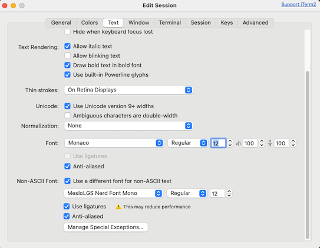
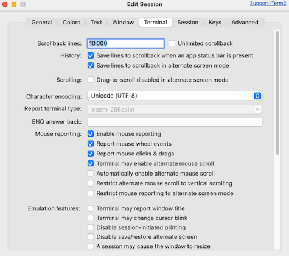

# Neovim installation

For Neovim to work well with your system and terminal, make sure you have installed all this requirements.

## System Package

Using homebrew here or equivalent package manager

```
brew install neovim

brew install fd
brew install  ripgrep

brew install --cask font-devicons
brew install --cask font-meslo-lg-nerd-font
brew install fontconfig

brew install tree-sitter
brew install tree-sitter-cli
```

## Term

In your terminal emulator
Use the patched glyphed foot and enable mouse reporting

I use iterm2 terminal and here is the revelent config options:





## Conform

```
brew install prettier
brew install shfmt
brew install stylua
brew install goimports
brew install gofumpt
brew install yamllint
brew install markdownlint-cli2
brew install taplo
```

## Go testing

```
brew install gotestsum
```

